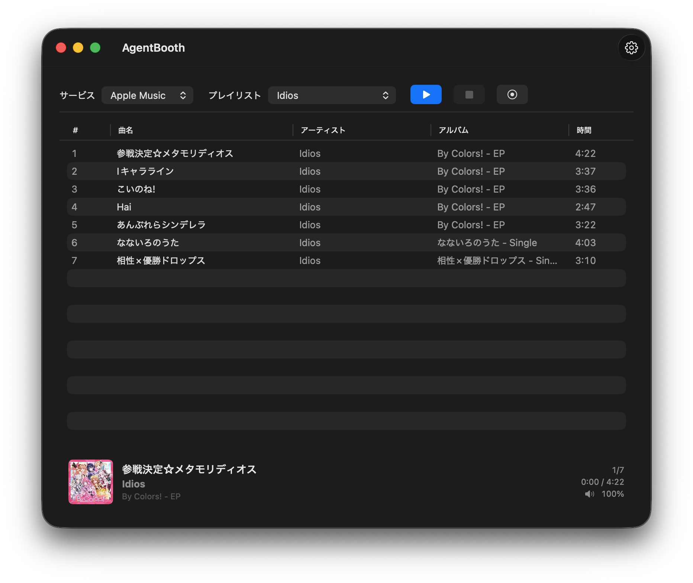

# AgentBooth

A macOS app that runs an AI-hosted radio show using your Apple Music, YouTube Music, or Spotify playlists.

AI writes the script, two hosts read it aloud, and it blends with music in real time.

---

## Requirements

- macOS 14 (Sonoma) or later
- One AI CLI for script generation (install at least one):
  - `claude` (Claude Code)
  - `gemini`
  - `codex` (ChatGPT Codex)
  - `copilot`
- Gemini API Key (used for text-to-speech — free at [Google AI Studio](https://aistudio.google.com/))

---

## Quick Start

1. Launch the app (first time: right-click → **Open**)
2. Open **Settings** → **Text-to-Speech** tab
3. Enter your Gemini API Key in **API Key** (free at [Google AI Studio](https://aistudio.google.com/))
4. Choose an AI in **CLI** (e.g. `claude`)
5. Close Settings, choose a playlist on the main screen, and press **Start**

Apple Music works immediately. YouTube Music and Spotify require signing in first (→ [How to Use](#how-to-use)).



> Tracks fetched from playlists are limited to a maximum of 30.

---

## Settings Guide

Open **Settings** from the toolbar and configure each tab.

### Text-to-Speech (configure this first)

The app cannot start without the API Key and CLI set.

| Field | Description |
|---|---|
| **API Key** | Your Gemini API Key from Google AI Studio |
| **TTS Model** | Gemini model for speech synthesis (defaults work out of the box) |
| **Fallback Model** | Backup model used if the primary model fails |
| **Male Voice** | Voice name for the male host (e.g. `Charon`) |
| **Female Voice** | Voice name for the female host (e.g. `Kore`) |
| **CLI** | AI CLI to use for script generation (`claude` / `gemini` / `codex` / `copilot`) |
| **CLI Model** | Model name for the CLI (leave blank to use the CLI's default) |

### Service

| Field | Description |
|---|---|
| **Default Service** | Music service selected by default on launch |
| **Sign in to YouTube Music** | Open the embedded browser to log in to YouTube Music |
| **Sign in to Spotify** | Open the embedded browser to log in to Spotify |

### Program Info

| Field | Description |
|---|---|
| **Overlap Mode** | How music and talk are blended (see below) |
| **Show Name** | Name of the radio show, used in script generation |
| **Frequency / Channel** | e.g. `77.5 FM` — used to set the mood of the script |
| **Male Host Name** | Display name for the male personality |
| **Female Host Name** | Display name for the female personality |
| **Scene / Direction** | Additional direction for script generation (e.g. "late night, quiet tone") |

### Music Playback

Balance between music and talk. Defaults work without changes.

| Field | Description |
|---|---|
| **Normal Volume** | Base music volume (0–100) |
| **Talk Volume** | Music volume while talk is playing (0–100). Lower = quieter music |
| **Fade Duration** | Seconds to smoothly ramp volume up or down |
| **Music Lead Seconds** | Seconds before talk ends to start fading in the next track |
| **Talk Start After Seconds** | Seconds after a track starts before talk begins (for intro overlay) |
| **Talk Start Before End Seconds** | Seconds before a track ends to start outro talk |
| **Max Playback Duration** | Maximum seconds per track (0 = unlimited) |

### Recording

Configure if you want to record the show.

| Field | Description |
|---|---|
| **Output Directory** | Folder for recording files. Defaults to `~/Music/AgentBooth/` |

> Recording captures system audio. A Screen Recording permission prompt appears on first use.
> System notifications and audio from other apps may also be captured — it is recommended to turn off notifications while recording.

---

## How to Use

### Common

1. Set **API Key** and **CLI** in the **Text-to-Speech** tab

### Apple Music

1. Select **Apple Music** as the service on the main screen
2. Choose a playlist
3. Press **Start**

> A macOS Automation permission dialog appears on first launch. Click **OK** to allow.

### YouTube Music

1. Go to **Service** tab → press **Sign in to YouTube Music**
2. Sign in via the embedded browser
3. The status indicator turns green when signed in
4. Close the window, select **YouTube Music** on the main screen
5. Choose a playlist and press **Start**

### Spotify

1. Go to **Service** tab → press **Sign in to Spotify**
2. Sign in via the embedded browser
3. The status indicator turns green when signed in
4. Close the window, select **Spotify** on the main screen
5. Choose a playlist and press **Start**

---

## Controls

| Button | Action |
|---|---|
| **Start** | Begin the show |
| **Pause** | Pause (shown during playback) |
| **Resume** | Resume (shown when paused) |
| **Stop** | Stop and return to the beginning |

The **NowPlayingBar** at the bottom shows the current track (with artwork) and the current show phase.

---

## Playback Modes

Select in **Program Info** → **Overlap Mode**.

| Mode | Behavior |
|---|---|
| **Natural FM Radio blend** | Talk overlaps both the beginning and end of tracks — closest to a real FM radio feel |
| **Talk over track start** | Talk begins a few seconds after the track starts, playing over the intro |
| **Talk over track end** | Track fades out and outro talk begins before the track ends |
| **Fully separated** | Talk then music, music then talk — no overlap |

---

## Troubleshooting

### Playlist is cut off after a certain number of tracks
The number of tracks fetched from playlists is limited to 30. If you select a playlist with more than 30 tracks, only the first 30 will be used.

### Apple Music playlist not loading

Open System Settings → Privacy & Security → Automation and confirm that **AgentBooth** has permission for **Music**.

### YouTube Music / Spotify showing "Not signed in"

- Complete the full sign-in flow in the embedded browser, then close the window and reopen the Settings tab
- If sign-in gets stuck, press **Clear Data** to remove site storage and try again

### Spotify playlist missing or playback stopping

Spotify Web Player may have updated its layout, breaking the integration. This is a known limitation.

### Script generation fails or doesn't start

- Confirm the CLI selected in **Text-to-Speech** is installed and runnable
- If the app cannot find the CLI, try entering the full path (e.g. `/usr/local/bin/claude`) in the CLI Model field, or verify the installation path

### No audio is generated

- Confirm the **API Key** in the **Text-to-Speech** tab is correct
- Check your remaining quota and key validity at Google AI Studio

---

## Developer Reference

### Architecture Overview

```
Domain/           Protocols and all value types (Protocols.swift / Models.swift)
App/              Entry point and DI (AppServiceContainer)
Features/         UI layer (ContentView / MainViewModel / SettingsView / NowPlayingBar)
Services/         Business logic (Radio / Script / TTS / Music / Audio)
Infrastructure/   External wrappers (AppleScript / WebView / Settings)
AgentBoothTests/  Unit tests + fake implementations (TestDoubles.swift)
```

### Key Components

**`RadioOrchestrator`** (`Services/Radio/`) — Swift `actor`. Core of the show. Drives phases: opening → intro → playing → transition/outro → closing. Coordinates music, TTS, and fade.

**`MainViewModel`** (`Features/Main/`) — `@MainActor ObservableObject`. Owns `RadioOrchestrator` and bridges `RadioState` to SwiftUI views.

**`ProcessScriptGenerationService`** (`Services/Script/`) — Spawns an external CLI subprocess to generate JSON scripts.

**`GeminiTTSService`** (`Services/TTS/`) — Calls Gemini REST API directly to produce WAV. Includes retry and fallback model logic.

**`AppleMusicService`** (`Services/Music/`) — Controls Music.app via `AppleScriptExecutor`.

**`YouTubeMusicService`** (`Services/Music/`) — `@MainActor`. Delegates to `YouTubeMusicAPIFetcher` (internal API) and `YouTubeMusicPlayerController` (playback).

**`SpotifyMusicService`** (`Services/Music/`) — `@MainActor`. Scrapes `open.spotify.com` DOM for playlist data and playback control.

**`YouTubeMusicWebViewStore`** / **`SpotifyWebViewStore`** — Each manages a login UI WebView and an offscreen playback WebView. Both share `WKWebsiteDataStore.default()` so cookies stay in sync.

### Directory Structure

```
AgentBooth/
├── AgentBooth/
│   ├── App/                        Entry point and DI
│   ├── Domain/                     Protocols.swift, Models.swift
│   ├── Features/
│   │   ├── Main/                   ContentView, MainViewModel, NowPlayingBar
│   │   ├── Settings/               SettingsView
│   │   ├── SpotifyBrowser/         Spotify login browser UI
│   │   └── YouTubeMusicBrowser/    YouTube Music login browser UI
│   ├── Infrastructure/
│   │   ├── Settings/               AppSettingsStore
│   │   ├── Music/                  AppleScriptExecutor, AppleMusicArtworkFetcher
│   │   ├── Spotify/                SpotifyDOMScripts, SpotifyScriptRunner
│   │   └── YouTube/                YouTubeMusicJSScripts, YouTubeMusicScriptRunner
│   └── Services/
│       ├── Radio/                  RadioOrchestrator
│       ├── Script/                 ProcessScriptGenerationService
│       ├── TTS/                    GeminiTTSService
│       ├── Audio/                  SystemAudioPlaybackService
│       ├── Recording/
│       └── Music/                  AppleMusicService, YouTubeMusicService, SpotifyMusicService
├── AgentBoothTests/                Unit tests + TestDoubles.swift
├── project.yml                     XcodeGen definition
└── handoff.md
```

### Script JSON Format

The CLI must write the following JSON to stdout.

```json
{
  "dialogues": [
    { "speaker": "male", "text": "..." },
    { "speaker": "female", "text": "..." }
  ],
  "summaryBullets": [
    "Key point from this segment",
    "Topic to avoid next time"
  ]
}
```

- `summaryBullets`: 2–4 short bullets
- Passed back to the next prompt only when the same artist/album repeats
- Legacy format with `dialogues` only is accepted for backwards compatibility

### Build and Test

```bash
# Generate project
xcodegen generate

# Run all tests
xcodebuild -project AgentBooth.xcodeproj -scheme AgentBooth \
  -destination 'platform=macOS' -derivedDataPath /tmp/AgentBoothDerived test

# Run a specific test class
xcodebuild -project AgentBooth.xcodeproj -scheme AgentBooth \
  -destination 'platform=macOS' -derivedDataPath /tmp/AgentBoothDerived test \
  -only-testing:AgentBoothTests/RadioOrchestratorTests
```

### Constraints

- App Sandbox is disabled (`ENABLE_APP_SANDBOX: NO`) — Mac App Store distribution is not yet supported
- Edit `project.yml` for build settings, then run `xcodegen generate` — do not edit `.xcodeproj` directly
- External CLIs are resolved from the app's process environment, which may differ from your shell PATH
- Spotify integration is DOM-based; selector breakage is expected when Spotify updates the Web Player UI
