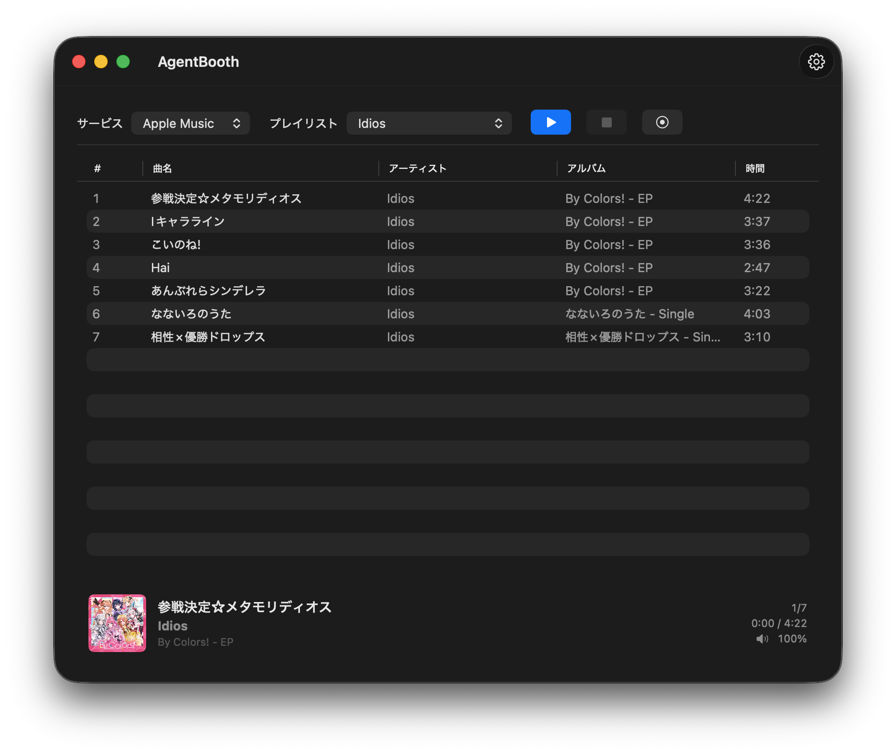

# AgentBooth

Apple Music / YouTube Music / Spotify のプレイリストを素材に、AI が自動進行するラジオ番組を流す macOS アプリです。

AI が台本を作り、2 人のパーソナリティが読み上げ、音楽と重ねて再生します。

<p align="center">
  <a href="https://products.desireforwealth.com/products/images/agentbooth_sample.mp4">
    
  </a>
  <p align="center"><em>デモ動画を見るには画像をクリック</em></p>
</p>

---

## 動作環境

- macOS 14 (Sonoma) 以降
- 台本生成に使う AI CLI（いずれか 1 つをインストールしておきます）
  - `claude`（Claude Code）
  - `gemini`
  - `codex`（ChatGPT Codex）
  - `copilot`
- Gemini API Key（読み上げに使用。[Google AI Studio](https://aistudio.google.com/) で無料取得可能です）

---

## クイックスタート

1. アプリを起動する（初回は右クリック → **開く**）
2. **設定** → **生成・TTS接続** を開く
3. Gemini TTS の資格情報セットに API Key を追加する（[Google AI Studio](https://aistudio.google.com/) で無料取得可能です）
4. **CLI** で台本生成に使う AI を選ぶ（例: `claude`）
5. 設定を閉じ、メイン画面でプレイリストを選んで **Start**

Apple Music はこれだけで動作します。YouTube Music / Spotify は先にログインが必要です（→ [使い方](#使い方)）。



> プレイリストからのトラック取得は最大 30 曲までに制限しています

---

## 設定ガイド

アプリを起動したら、ツールバーの **設定** ボタンを開いてサイドバーの各項目を設定します。

### プロフィール

プロフィールは、番組の体験を再利用できる設定セットとして保存する機能です。**プロフィール管理** で作成、複製、リネーム、削除、切り替えができます。アクティブプロフィールはメイン画面のツールバーからも切り替えられますが、番組の再生中は変更できません。

プロフィールに含まれる設定:

- 番組名、周波数・チャンネル名、地域名、ホスト名
- ボイス名、台本ディレクション、演技ディレクション、時間帯別プリセット
- オーバーラップモード、音楽/トーク音量、フェード、最大再生秒数
- ベッド BGM、ジングル、選択した音源、BGM/ジングル音量

音楽サービスのログイン、TTS 資格情報、台本生成 CLI、録音出力先はアプリ共通設定のため、プロフィールを切り替えても変わりません。

### 生成・TTS接続

最初に設定する項目です。API Key と CLI が未設定だと番組を開始できません。

| 項目 | 説明 |
|---|---|
| **Gemini TTS 資格情報セット** | API Key とモデルの組み合わせ。利用可能なセットを上から順に試します |
| **CLI** | 台本生成に使う AI CLI を選ぶ（`claude` / `gemini` / `codex` / `copilot`）(**必須**) |
| **CLI モデル** | CLI で使うモデル名（空欄にするとその CLI の既定値を使う） |

### サービス

| 項目 | 説明 |
|---|---|
| **既定のサービス** | 起動時にデフォルトで選ばれる音楽サービス |
| **YouTube Music でログイン** | YouTube Music を使う場合にここからログインします |
| **Spotify でログイン** | Spotify を使う場合にここからログインします |
| **User Agent** | YouTube Music 用の任意の User Agent 上書き。空欄なら WKWebView の既定値を使います |

### 番組情報

| 項目 | 説明 |
|---|---|
| **番組名** | 台本に反映される番組名 |
| **周波数・チャンネル名** | 例: `77.5 FM`（台本の雰囲気づけに使う） |
| **地域名** | 任意の地域名。設定すると、CLI が確認できる場合だけ現在の天気に軽く触れることがあります |
| **男性ホスト名** | 男性パーソナリティの名前 |
| **女性ホスト名** | 女性パーソナリティの名前 |

### 声と話し方

| 項目 | 説明 |
|---|---|
| **男性ボイス** | 男性パーソナリティの声（例: `Charon`） |
| **女性ボイス** | 女性パーソナリティの声（例: `Kore`） |
| **台本ディレクション** | 台本生成向けのコンテンツ・話題指示（例: 新譜特集で、アーティストの経歴にも触れて）。朝・夜などの時間帯を指定した場合は、リアル時刻よりその番組上の時間帯が優先されます |
| **演技ディレクション** | TTS の声のトーン・演技指示（例: 深夜帯、静かに話す） |
| **時間帯別プリセット** | 早朝・朝・昼・夕方・夜・深夜ごとの任意の演技指示。該当する時間帯のプリセットが、TTS の演技ディレクションに追記されます |

台本生成プロンプトには、ローカルの時刻・曜日・月・季節が自動で含まれます。台本ディレクションで別の時間帯を明示した場合は、その指定を番組上の時間帯として扱い、リアル時刻と矛盾する表現を避けます。天気は AgentBooth 側では取得せず、地域名が設定されている場合に限り、選択した CLI が確認できれば触れてよいという指示だけを渡します。

### 楽曲の再生

音楽とトークのバランス調整。既定値のままでも動作します。

| 項目 | 説明 |
|---|---|
| **オーバーラップモード** | 音楽とトークを重ねるか、分けるか（後述） |
| **台本生成モード** | オンデマンド（既定）または事前生成（レビュー付き）（後述） |
| **通常音量** | 音楽の基準音量（0〜100） |
| **トーク時音量** | トーク中に下げる音量（0〜100）。小さいほど音楽が小さくなる |
| **フェード秒数** | 音量を滑らかに変える時間（秒） |
| **楽曲先行開始秒数** | トーク終了前に次の曲を重ねて流し始める秒数 |
| **曲終了前のトーク再開秒数** | 曲が終わる何秒前からトークを開始するか |
| **楽曲最大再生秒数** | 1 曲あたりの上限時間（0 で無制限） |

BGM とジングルを設定すると、よりラジオらしい音像を追加できます。ベッド BGM は外部楽曲が鳴っていない単独トーク区間だけでループ再生され、楽曲開始前にフェードアウトします。ジングルは有効にした場合のみ、オープニング前またはクロージング前に再生されます。

| 項目 | 説明 |
|---|---|
| **ベッド BGM を有効にする** | 単独トーク区間の下に、選択した音声ファイルまたはフォルダ内のランダムな音声ファイルをループ再生する |
| **オープニングでジングルを使う** | オープニングトークの前に選択したジングルを再生する |
| **クロージングでジングルを使う** | クロージングトークの前に選択したジングルを再生する |
| **ベッド BGM / オープニングジングル / クロージングジングル** | **選択** から音声ファイルまたはフォルダを選択する。ダイアログは前回選択位置で開き、フォルダ指定時は再生時にランダム選択されます |
| **ベッド音量** | ベッド BGM の音量 |
| **ジングル音量** | ジングルの音量 |
| **ベッドフェードアウト秒数** | ベッド BGM を止めるときのフェード時間 |

### 録音

番組を録音したい場合に設定します。

| 項目 | 説明 |
|---|---|
| **録音出力先** | 録音ファイルの保存先フォルダ。空欄なら `~/Music/AgentBooth/` に保存されます |

> 録音はシステム音声全体を収録します。初回録音時に「画面収録」の権限確認が表示されます。
> システム通知や他のアプリの音も録音されるため、録音中は通知をオフにすることをおすすめします。

### アップデート

| 項目 | 説明 |
|---|---|
| **現在のバージョン** | インストール済みのバージョンとビルド番号 |
| **最終チェック** | 最後にアップデートを確認した日時 |
| **今すぐ確認** | 手動でアップデートを確認する |
| **自動的にアップデートを確認する** | バックグラウンドでの定期チェックを有効/無効にする（1日1回） |

メニューバーの **AgentBooth** → **アップデートを確認…** からも手動確認できます。

---

## 使い方

### 共通

1. **テキスト読み上げ**タブで API Key と CLI を設定する

> Gemini API Key は [Google AI Studio](https://aistudio.google.com/) で無料取得できます。APIキーとモデルのセットを複数設定可能で、上から順番に試行されます。無料枠の API制限に達した場合のみ有料枠を使用する、などの用途に便利です。

2. 台本生成に使う AI CLI を選ぶ。

> Gemini CLIは無料で利用開始することができます。その他、ローカルLLMを利用したい場合など、任意の外部CLIを設定することもできます。

### Apple Music

1. メイン画面でサービスに **Apple Music** を選ぶ
2. プレイリストを選ぶ
3. **Start** で番組開始

> 初回起動時に「自動化」の許可を求めるダイアログが表示されます。**許可** を選んでください。

### YouTube Music

1. **サービス**タブ → **YouTube Music でログイン** を押す
2. 表示された内蔵ブラウザで YouTube Music にログインする
3. ログイン成功後、ログイン状態が **ログイン済み**（緑）に変わる
4. ウィンドウを閉じて、メイン画面でサービスに **YouTube Music** を選ぶ
5. プレイリストを選んで **Start**

### Spotify

1. **サービス**タブ → **Spotify でログイン** を押す
2. 表示された内蔵ブラウザで Spotify にログインする
3. ログイン状態が **ログイン済み**（緑）に変わる
4. ウィンドウを閉じて、メイン画面でサービスに **Spotify** を選ぶ
5. プレイリストを選んで **Start**

---

## 操作

| ボタン | 動作 |
|---|---|
| **Start** | 番組開始 |
| **Pause** | 一時停止（再生中に表示） |
| **Resume** | 再開（一時停止中に表示） |
| **Stop** | 停止して最初に戻る |

画面下部の **NowPlayingBar** に現在のトラック（アートワーク付き）と番組の進行状態が表示されます。

---

## 再生モード

### オーバーラップモード

楽曲の再生タブの **オーバーラップモード** で選択できます。

| モード | 動作 |
|---|---|
| **トークと曲を重ねる** | 曲の終わりや次曲の入りでトークを重ねる |
| **トークと曲を分ける** | 曲が止まってからトーク、トークが終わってから次の曲を流す |

### 台本生成モード

楽曲の再生タブの **台本生成モード** で選択できます。

| モード | 動作 |
|---|---|
| **オンデマンド生成** | 再生中に台本を1つずつ生成する（既定の動作） |
| **事前生成（レビュー）** | 再生前に全台本（オープニング・各トランジション・クロージング）を一括生成。レビュー画面で全発話テキストと TTS 演技指示を確認・編集してから再生を開始。TTS 音声は再生中にオンデマンドで生成されます |

**事前生成（レビュー）** モードの使い方:
1. **再生** を押す — 全台本が順番に生成されます（進捗はステータスバーに表示）
2. レビューシートが開き、各セグメントの会話テキスト・TTS 演技指示・音声設定が表示されます
3. 必要に応じて会話テキストや TTS 演技指示を編集します
4. **承認して再生** を押すと再生が開始されます。**キャンセル** で破棄して停止します

承認済みの事前生成台本は、再生中だけ active cache としてローカルに保存されます。番組が正常終了する前に停止したりエラーになった場合、同じプレイリスト・同じ曲順で再度開始すると再利用確認が表示されます。**再利用** を選ぶと台本生成をスキップしてレビューシートを再表示し、**作り直す** を選ぶと active cache をアーカイブ名へ退避して新しく生成します。番組が最後まで正常に完走したときも active cache は再利用対象から外されますが、JSON ファイル自体は履歴として cache フォルダに残ります。

---

## トラブルシューティング

### プレイリストが途中で切れている

プレイリストから取得する曲数の上限は 30 曲に設定しています。多い曲数のプレイリストを選んだ場合、最初の 30 曲のみが使用されます。

### Apple Music のプレイリストが取得できない

システム設定 → プライバシーとセキュリティ → 自動化 を開き、**AgentBooth** の項目に **Music** の許可が入っているか確認してください。

### YouTube Music / Spotify のログイン状態が「未ログイン」のまま

- 内蔵ブラウザでログインを完了してからウィンドウを閉じ、再度設定タブを開いて確認してください
- ログインが途中で詰まる場合は **データを削除** を押してサイトデータを消去してから再ログインしてください

### Spotify でプレイリストが取得できない・再生が止まる

Spotify Web Player の画面構造が変わると動作しなくなることがあります。

### 台本生成が始まらない・エラーになる

- **テキスト読み上げ**タブで選んだ CLI（`claude` など）がインストール済みか確認してください
- CLI のインストール先によってはアプリから見つからない場合がある。その場合はフルパス（例: `/usr/local/bin/claude`）で CLI モデル欄に入力するか、インストール場所を確認してください

### 音声（読み上げ）が生成されない

- **テキスト読み上げ**タブで Gemini **API Key** が正しく設定されているか確認してください
- API Key の残量や有効期限を Google AI Studio で確認してください

---

## 開発者向け情報

### アーキテクチャ概要

```
Domain/           プロトコルと全バリュー型（Protocols.swift / Models.swift）
App/              エントリポイント・DI（AppServiceContainer）
Features/         UI 層（ContentView / MainViewModel / SettingsView / NowPlayingBar）
Services/         ビジネスロジック（Radio / Script / TTS / Music / Audio / Context）
Infrastructure/   外部依存ラッパー（AppleScript / WebView / Settings）
AgentBoothTests/  ユニットテスト + フェイク実装（TestDoubles.swift）
```

### 主要コンポーネント

**`RadioOrchestrator`** (`Services/Radio/`) — Swift `actor`。番組進行の中核。opening → intro → playing → transition/outro → closing のフェーズを駆動し、音楽・TTS・フェードを協調制御する。曲開始/終了、フェード、ナレーション再生も cuesheet に記録する。

**`MainViewModel`** (`Features/Main/`) — `@MainActor ObservableObject`。`RadioOrchestrator` を保持し、UI 状態 (`RadioState`) を SwiftUI ビューへブリッジする。

**`ProcessScriptGenerationService`** (`Services/Script/`) — 外部 CLI サブプロセスを呼び出して JSON 台本を生成する。セッションごとのスクリプト保存フォルダには `cuesheet.txt` も併せて出力される。

**`RealtimeContextProvider`** (`Services/Context/`) — 台本プロンプトにローカルの時刻・曜日・月・季節・任意の地域名を追加する。AgentBooth 自体は天気を直接取得しない。

**`GeminiTTSService`** (`Services/TTS/`) — Gemini REST API を直接呼び出して WAV を生成する。リトライ・フォールバックモデルあり。各試行のステータスやフォールバック状況も cuesheet に残す。

**`AppleMusicService`** (`Services/Music/`) — `AppleScriptExecutor` 経由で Music.app を制御する。

**`YouTubeMusicService`** (`Services/Music/`) — `@MainActor`。`YouTubeMusicAPIFetcher`（内部 API 呼び出し）と `YouTubeMusicPlayerController`（再生制御）に委譲する。

**`SpotifyMusicService`** (`Services/Music/`) — `@MainActor`。`open.spotify.com` の DOM をスクレイプしてプレイリスト取得・再生制御を行う。

**`YouTubeMusicWebViewStore`** / **`SpotifyWebViewStore`** — ログイン UI 用 WebView と再生専用 WebView（オフスクリーン `NSWindow`）の 2 本を管理する。`WKWebsiteDataStore.default()` を共有して Cookie を自動同期する。

### ディレクトリ構成

```
AgentBooth/
├── AgentBooth/
│   ├── App/                        エントリポイント・DI
│   ├── Domain/                     Protocols.swift, Models.swift
│   ├── Features/
│   │   ├── Main/                   ContentView, MainViewModel, NowPlayingBar
│   │   ├── Settings/               SettingsView
│   │   ├── SpotifyBrowser/         Spotify ログインブラウザ UI
│   │   └── YouTubeMusicBrowser/    YouTube Music ログインブラウザ UI
│   ├── Infrastructure/
│   │   ├── Settings/               AppSettingsStore
│   │   ├── Music/                  AppleScriptExecutor, AppleMusicArtworkFetcher
│   │   ├── Spotify/                SpotifyDOMScripts, SpotifyScriptRunner
│   │   └── YouTube/                YouTubeMusicJSScripts, YouTubeMusicScriptRunner
│   └── Services/
│       ├── Radio/                  RadioOrchestrator
│       ├── Script/                 ProcessScriptGenerationService
│       ├── TTS/                    GeminiTTSService
│       ├── Audio/                  SystemAudioPlaybackService
│       ├── Context/                RealtimeContextProvider
│       ├── Recording/
│       └── Music/                  AppleMusicService, YouTubeMusicService, SpotifyMusicService
├── AgentBoothTests/                ユニットテスト + TestDoubles.swift
├── project.yml                     XcodeGen 定義
└── handoff.md
```

### 台本生成 JSON 形式

CLI は以下の JSON を stdout に出力する必要がある。

```json
{
  "dialogues": [
    { "speaker": "male", "text": "発話内容" },
    { "speaker": "female", "text": "発話内容" }
  ],
  "summaryBullets": [
    "今回触れた話題の要点",
    "次回は避けたい観点"
  ]
}
```

- `summaryBullets`: 2〜4 件の短い箇条書き
- トランジション用プロンプトの番組内話題台帳として使われ、後半のトークで前半の話題を繰り返さないようにする。同一アーティスト / 同一アルバム時は、さらに局所的な連続性メモも渡す
- `dialogues` のみの旧形式も後方互換で受理する

### ビルド・テスト

```bash
# プロジェクト生成
xcodegen generate

# 全テスト
xcodebuild -project AgentBooth.xcodeproj -scheme AgentBooth \
  -destination 'platform=macOS' -derivedDataPath /tmp/AgentBoothDerived test

# 特定テストクラスのみ
xcodebuild -project AgentBooth.xcodeproj -scheme AgentBooth \
  -destination 'platform=macOS' -derivedDataPath /tmp/AgentBoothDerived test \
  -only-testing:AgentBoothTests/RadioOrchestratorTests
```

### 制約・注意事項

- App Sandbox 無効（`ENABLE_APP_SANDBOX: NO`） — Mac App Store 配布未対応
- `project.yml` を編集 → `xcodegen generate` でプロジェクト再生成する（`.xcodeproj` は直接編集しない）
- 外部 CLI はアプリのプロセス環境から解決する（シェルの `$PATH` と異なる場合がある）
- Spotify 連携は DOM 制御のため、Spotify Web Player UI 変更でセレクターが壊れる可能性あり
